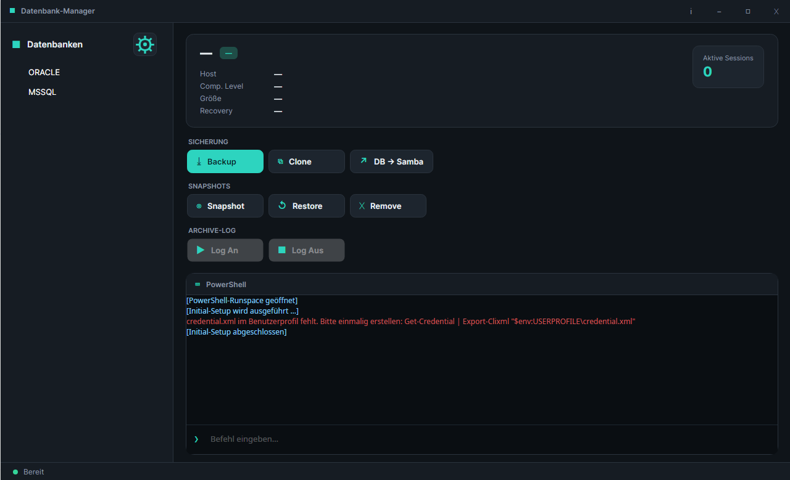
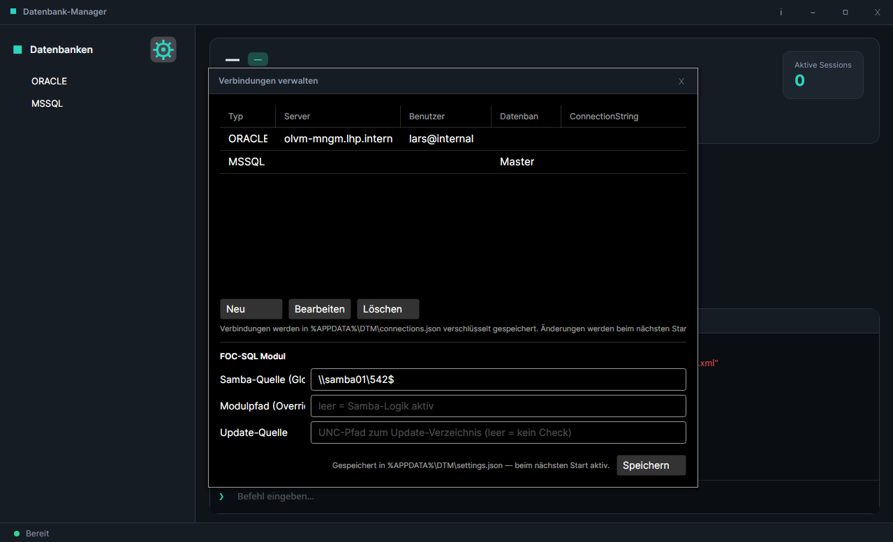

# DTM — Datenbank-Manager

Avalonia-Desktop-App (.NET 10) zur Verwaltung von MSSQL- und Oracle-Datenbanken
(Backup, Clone, Snapshot, Archive-Log, Samba-Copy). Alle Datenbank-Aktionen
laufen über das PowerShell-Modul **FOC-SQL.psm1**; DTM baut kein eigenes
Remoting nach, sondern ruft die Modulfunktionen in einer eingebetteten
PowerShell-Session auf.

Entwickelt von **Lars Oste** · Landeshauptstadt Potsdam · Fachbereich 54.2



---

## Voraussetzungen

- .NET 10 SDK / Runtime
- Windows (für die Modul-Aktionen; die App selbst läuft auch unter Linux,
  aber die FOC-SQL-Funktionen benötigen die Windows-/Domänen-Umgebung)
- Eine `credential.xml` im Benutzerprofil:
  ```powershell
  Get-Credential | Export-Clixml "$env:USERPROFILE\credential.xml"
  ```
- Das FOC-SQL-Modul unter der konfigurierten Samba-Quelle.

---

## Einrichtung

1. Repo klonen — bei Bedarf inklusive Dev-Submodul (`external/FOC-SQL/`,
   reine Code-Referenz, nicht zur Laufzeit nötig):
   ```
   git clone --recurse-submodules https://github.com/Kroste/DTM.git
   # oder, falls schon geklont:
   git submodule update --init external/FOC-SQL
   ```
   Das Submodul unter `external/FOC-SQL/` ist eine reine Entwicklungs-Referenz
   auf den FOC-SQL-Quellcode. Die App lädt FOC-SQL zur Laufzeit weiterhin über
   die in den Einstellungen konfigurierte Samba-Quelle bzw. den Modulpfad-Override.

2. Bauen und starten:
   ```
   dotnet build DTM.csproj -c Release
   dotnet run --project DTM.csproj -c Release
   ```
3. Verbindungen über das ⚙-Symbol neben „Datenbanken" einrichten.
4. Im selben Dialog Samba-Quelle, optionalen Modul-Pfad und Update-Quelle
   eintragen und **Speichern** klicken.

---

## Verbindungen verwalten

Das ⚙-Symbol neben der „Datenbanken"-Überschrift öffnet den Dialog
**Verbindungen verwalten**.



| Feld | Bedeutung |
|------|-----------|
| Typ | Datenbanktyp (`MSSQL`, `ORACLE`) — DropDown |
| Server | Hostname oder IP des Datenbankservers |
| Benutzer | DB-Benutzername |
| Passwort | Wird verschlüsselt gespeichert (DPAPI unter Windows, Base64 unter Linux) |
| Datenbank | Standard-Datenbankname |
| ConnectionString | Optionaler ODBC-ConnectionString; überschreibt Server/User/Passwort |

Aktionen: **Neu**, **Bearbeiten** (Doppelklick oder Schaltfläche), **Löschen**.
Änderungen werden sofort in `%APPDATA%\DTM\connections.json` persistiert.

Unter **FOC-SQL Modul** im gleichen Dialog:

| Feld | Bedeutung |
|------|-----------|
| Samba-Quelle | UNC-Pfad mit `FOC-SQL.psm1` (z. B. `\\server\share\Modules\FOC`) |
| Modulpfad (Override) | Absoluter lokaler Pfad; leer = Samba-Logik aktiv |
| Update-Quelle | UNC-Pfad zum DTM-Rollout-Verzeichnis (s. u.) |

---

## Auto-Update

DTM prüft beim Start automatisch, ob unter der konfigurierten **Update-Quelle**
eine neuere Version bereitsteht. Ein manueller Check ist jederzeit über
**ℹ → Update prüfen** in der About-Box möglich.

### Ablauf

1. DTM liest `<Update-Quelle>\version.txt` und vergleicht den Inhalt mit der
   laufenden `AssemblyInformationalVersion`.
2. Ist eine neuere Version verfügbar, erscheint ein Dialog:

   | Option | Verhalten |
   |--------|-----------|
   | **Jetzt aktualisieren** | Kopiert das Rollout-Verzeichnis in ein Temp-Verzeichnis, startet ein PowerShell-Skript (`dtm_update.ps1`), das nach dem Beenden von DTM die Dateien überschreibt und die App neu startet, dann beendet sich DTM sofort. |
   | **Später (30 min)** | Erinnerung nach 30 Minuten. |
   | **Überspringen** | Kein weiterer Hinweis in dieser Sitzung. |

### Rollout-Verzeichnis vorbereiten

```
\\server\share\DTM-Rollout\
  ├── DTM.exe
  ├── DTM.dll
  ├── … (alle Publish-Dateien)
  └── version.txt          ← Inhalt: 1.0.3  (nur die Versionsnummer, keine Leerzeichen)
```

`version.txt` muss eine gültige .NET-`Version`-Zeichenkette enthalten
(z. B. `1.0.3`). DTM vergleicht per `Version.Parse`; ist die Datei-Version
größer als die laufende, wird der Update-Dialog angezeigt.

### GitHub Actions / CI-Builds

Bei einem Git-Tag (`v*`) läuft die Workflow-Datei `.github/workflows/release.yml`:
- Tests auf Ubuntu
- Self-contained Builds für `win-x64` (`.zip`) und `linux-x64` (`.tar.gz`)
- GitHub Release mit automatischen Release-Notes

Die Build-Artefakte können anschließend manuell ins Rollout-Verzeichnis
entpackt werden; `version.txt` wird während des Builds aus dem Tag erzeugt.

---

## Aktionen

| Button | Modulfunktion | Zeitplanung | Interaktiv |
|--------|---------------|-------------|------------|
| Backup           | `Backup-Database`         | ja  | – |
| Clone            | `Sync-Database-ToTest`    | ja  | – |
| DB → Samba       | `Copy-Database-ToSamba`   | –   | – |
| Snapshot         | `Set-Snapshot`            | ja  | – |
| Restore          | `Restore-Snapshot`        | –   | Oracle: Vorab-Dialog mit Restore-Points + PDB-Liste; MSSQL: pwsh-Prompt |
| Remove           | `Remove-Snapshot`         | –   | ja |
| ArchiveLog An    | `Set-Archive-Log`         | –   | – |
| ArchiveLog Aus   | `Set-Archive-Log -Off`    | –   | – |
| Cluster-Health   | `Get-ClusterHealthStatus` | –   | – (MSSQL-only, read-only Status im Info-Card) |

Zeitplanung: Im Zeit-Dialog „Sofort" oder „Geplant" (Datum/Uhrzeit) wählen.
Interaktive Aktionen (Restore/Remove) zeigen Prompts im pwsh-Tab;
Antworten (Nummer, `ja`/`j`) in die Befehlszeile tippen.

**ArchiveLog-Buttons** togglen je nach DB-Typ unterschiedlich:
- **Oracle**: echter `ARCHIVELOG ON/OFF`.
- **MSSQL**: `Recovery FULL/SIMPLE` (`Set-Archive-Log` dispatched im Modul nach
  DB-Typ — siehe `CLAUDE.md` „Akzeptierte Abweichungen").

Die Buttons spiegeln den aktuellen Modus: ist „ON"/`FULL` aktiv, ist „Log An"
deaktiviert und „Log Aus" klickbar — und umgekehrt. Nach einem Klick
aktualisieren sich die Stats automatisch nach ca. 8 Sekunden.

**Oracle-Restore-Vorschau:** Bei Oracle öffnet sich vor `Restore-Snapshot` ein
Dialog mit den verfügbaren Restore Points und der PDB-Liste der CDB. Bei
Multi-PDB-Konfiguration wird prominent gewarnt — `Restore-Snapshot` fährt die
gesamte CDB herunter und setzt sie auf den gewählten Restore Point zurück
(alle PDBs sind betroffen, nicht nur die ausgewählte).


---

## Benutzeroberfläche

- **Titelleiste** — eigene Titelleiste ohne nativen OS-Rahmen
  (`SystemDecorations="BorderOnly"`).
  - **ℹ** öffnet die About-Box (Version, Entwickler, Update-Check).
  - **−** minimiert, **⊡/❐** maximiert/restauriert, **✕** schließt.
- Alle Dialoge verwenden denselben Style (draggable Titelleiste, nur Schließen-Button).

---

## Datenspeicherung

| Datei | Inhalt |
|-------|--------|
| `%APPDATA%\DTM\connections.json` | Verbindungsliste (Passwörter verschlüsselt) |
| `%APPDATA%\DTM\settings.json` | FocSql-Einstellungen (SambaSource, ModulePath, UpdateSource) |

Beide Dateien werden beim ersten Speichern automatisch angelegt.

---

## Logging

DTM verwendet **NLog**. Die Log-Dateien liegen neben der Anwendung unter `logs/`:

| Datei | Inhalt |
|-------|--------|
| `logs/info.log` | Debug- und Info-Meldungen (Verbindungsaufbau, DB-Ladevorgänge, Aktionen) |
| `logs/error.log` | Warnungen und Fehler |
| `logs/powershell.log` | Gesamte PS-Terminal-Ausgabe (Ein-/Ausgaben, Fehler, Job-Header); tägliche Archivierung, 7 Tage Aufbewahrung |

Passwörter und Credentials werden **nicht** geloggt.
Connection-Strings werden maskiert (`PWD=***`, `Password=***`).

---

## Architektur (Kurzüberblick)

- **Views/** — Avalonia-UI (alle Fenster mit eigenem Titelleisten-Style).
  - `MainWindow` — DB-Baum, Info-Anzeige, Aktions-Buttons, PowerShell-Konsole.
  - `ConnectionManagerWindow` / `EditConnectionWindow` — Verbindungsverwaltung.
  - `TimePickerWindow` — Zeitplanung für Backup/Clone/Snapshot.
  - `SessionsWindow` — Anzeige aktiver DB-Sessions.
  - `UpdatePromptWindow` — Update-Dialog (Jetzt / Später / Überspringen).
  - `AboutWindow` — Versionsinfo, Entwickler, manueller Update-Check.
- **ViewModels/** — MVVM (CommunityToolkit.Mvvm).
  - `MainWindowViewModel` — Aktionen, Statistik-Anzeige, Baum-Aufbau, Auto-Update.
  - `ConnectionManagerViewModel` — Verbindungsliste, FocSql-Einstellungen.
  - `EditConnectionViewModel` — Formular für eine einzelne Verbindung.
- **Data/Config/**
  - `ConnectionStore` — `connections.json` (DPAPI/Base64-Passwortschutz).
  - `AppSettingsStore` — `settings.json`.
  - `FocSqlRuntime` — Laufzeit-Zustand der FocSql-Konfiguration.
- **Data/Updater/**
  - `UpdateService` — Versions-Check gegen `version.txt` auf der Update-Quelle;
    kopiert Rollout-Verzeichnis und startet `dtm_update.ps1`.
- **Data/Terminal/**
  - `PowerShellTerminalSession` — in-process Runspace mit `DtmPSHost`/`DtmPSHostUI`.
  - `TerminalBus` — Mediator zwischen ViewModel-Aktionen und Session.
  - `AnsiParser` / `AnsiPalette` / `AnsiConsole` — farbige Ausgabe.
- **Data/HelperClasses/**
  - ODBC-Zugriff für DB-Liste und Statistik (MSSQL/Oracle).
  - `LogMask` — maskiert Passwörter in Connection-Strings vor dem Logging.
  - `ORACLE_REST` — oVirt/OLVM REST-API für VM-FQDNs.

---

## Tests

```
dotnet test DTM.Tests/DTM.Tests.csproj
```

Die Test-Suite (~269 Tests, xUnit + FluentAssertions) deckt ab:

- `Data/Config/` — ConnectionStore, AppSettingsStore, ConnectionEntry
- `Data/Terminal/` — AnsiParser, AnsiPalette, FocSqlRuntime, TerminalBus, DtmPSHostUI
- `Data/HelperClasses/` — ServerCredential, DB_SERVER, Database_Info, Database_Stats-Varianten
- `Data/` — DTM_DATA (Routing via FakeFactory), AsyncUtil
- `ViewModels/` — MainWindowViewModel, ConnectionManagerViewModel, EditConnectionViewModel,
  SessionsViewModel, TimePickerViewModel, TreeNode-ViewModels

Keine Abhängigkeit auf DB-Server, Avalonia-UI-Thread oder PowerShell-Runspace.
